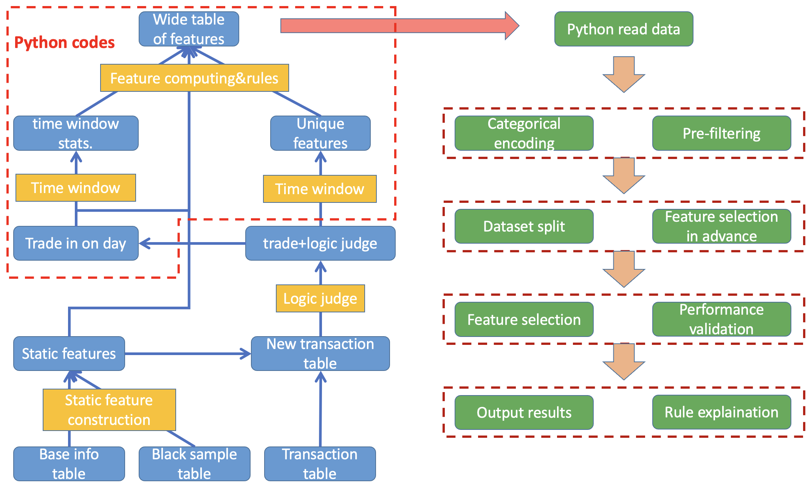

# Pipeline of Fraud Detection for Bank Transactions

This is an integral pipeline(standardization document) of constructing lightgbm model including preprocessing, parameter setting, train+predict_eval procedure, and feature selection for transactional features of bank users to detect fraud, available for current industry situations.  

The intention is only used for private use in my own work. Hopefully, it facilitates and speeds up my work efficiency and performance. Due to confidentiality and privacy issues considering bank transactions, raw data is not suitable to publish public, only demos and templates.

The modeling for fraud detection mainly consists of two parts:

1. feature engineering part, which aims at extracting features from transactional data tested useful and productive in industry setting. See "Feature Standardization.markdown" file for more details;
2. model construction part, including almost everything when building a machine learning model, and serves as a fancy tool for both a baseline and later a fine-tuned version which can meet the demand in industry. See "pipeline of model construction.ipynb" for more details. 

Those procedures have been proven successful in practice for a lot of times and under various circumstances in different bank branches settings nationwide.

Here is a flow chart for the pipeline.

